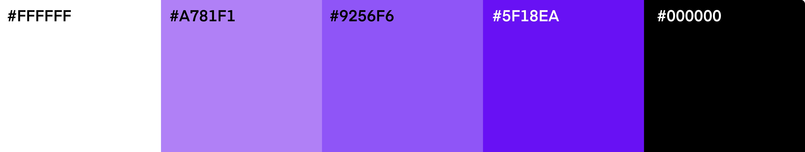
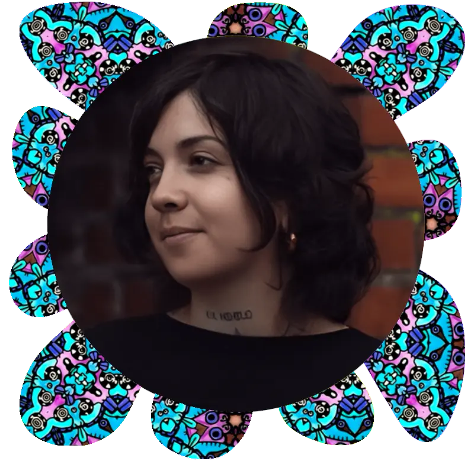
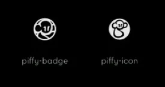

<h1 align="center"> Welcome to Kim Jevon's Porfolio </h1>

[Kim Jevon](https://kimjev-webdev.github.io/Unit1/index.html) is a visual artist and an aspiring web developer. The purpose of this portfolio site is to combine and demonstrate Kim's creative talents alongside her new front-end technical skills.  The main goal of the website is to help establish an online presence that can help open doors to new professional opportunities. The site blends aesthetic sensibility with technical functionality, showcasing how Kim's former experiences as an artist can be beneficial to her web development projects. The result is a user-friendly, intuitive, visually appealing site with a simple and coherent navigation. The style choices such as the colour palette, images and fonts complement the artwork, which takes centre stage on the responsive gallery page. 

## Table of Contents

    
<a href="#ux">UX</a>

 <ul>
 
<a href="#goals">Planning & Goals</a>

    - [Business Goals]
    - [User Profiles]
    - [User Stories]
    - [Minimum Viable Product]
</ul

   <li>

    
<a href="#visual-design">2. Visual Design</a>

    - [Wireframes](#wireframes)
    - [Fonts](#fonts)
    - [Icons](#icons)
    - [Colors](#colors)
    - [Images](#images)
    - [Styling](#styling)
    
</li>
    </ul>

## UX - Planning & Goals

### 1. Business Goals 

#### Primary Goal 
The primary goal for this portfolio website is to showcase artistic and technical skills in a way that attracts potential clients or employers. The dual focus on both artwork and web development should inherently demonstrate Kim's versatility and ability to bridge the gap between creative and technical fields. 

Further business goals are:

 Showcase artistic & technical skills 

<li>Present a cohesive portfolio that highlights both Kim’s visual artwork and web development project to demonstrate proficiency in both areas.</li>

 

 Attract potential clients/employers 

<li>Generate interest from companies or individuals looking for web developers, leveraging Kim’s unique background in art.</li>

 Build upon personal brand 

<li>Establish a strong online presence that reflects Kim’s identity, style, and values, helping to differentiate her in a competitive market.</li>

 Facilitate networking opportunities 

<li>Create a platform for connecting with other artists, developers, and industry professionals. Foster a community around Kim's work through social media links & newsletters which encourage engagement and repeat visits to the site.</li>

Generate leads for freelance work

<li>Encourage inquiries for freelance projects or commissions with a contact form and clear calls to action.</li>

 Increase online visibility 

<li>Optimize the website for search engines (SEO) to attract organic traffic, ensuring that the portfolio is discoverable by potential clients or collaborators.</li>

Showcase learning 

<li>Highlight new skills & technologies learned, demonstrating commitment to personal and professional development.</li>

### 2. User Profiles

Potential employers/clients 

<li>Individuals or companies looking to hire Kim for freelance projects or employment.</li>

Fellow artists/web developers

<li>Creative professionals interested in collaboration, networking, or gaining inspiration from Kim's work.</li>

Art enthusiasts/collectors

<li>People who appreciate art/design and want to explore Kim's work for personal enjoyment, inspiration, or even commission/buy artwork.</li>

Recruiters

<li>Professionals searching for candidates to fill positions in creative or tech companies who need to assess Kim’s skills and experience.</li>

Students/learners

<li>Inividuals interested in learning from the Kim's journey, techniques, and processes in both art and web development.</li>

### 3. User Stories 

### 4. Minimum Viable Product

 

Responsive Design
 
<li>Ensure the website is accessible and looks good on various devices (desktops, tablets, smartphones).</li>

Navigation

<li> An easy-to-navigate menu that includes links to the homepage, gallery, about page, and contact information.</li>
<li>A footer with navigation links, social links and newsletter sign up so option to connect is on every page.</li>
 

 

 
Homepage

<li>A striking hero image/carousel that shows Kim’s style and immediately communicates her creative skills.</li>
<li>A short introduction to give context and spark interest with a call to action leading to more in depth information.</li>

About Page

<li>A section that highlights Kim’s experience in art and career aspirations for web development with option to download C.V.</li>
<li>A biography that includes information about Kim’s journey and influences.</li>
<li>Profile image.</li>

Gallery Section

<li>A dedicated gallery showcasing Kim’s work with high-quality images.</li>

Contact Information

 <li>A simple contact form for inquiries or collaboration requests.</li>
 <li>Social Media Links: Links to the Kim’s social media profiles to encourage further engagement.</li>
 

## UX - Visual Design

### 1. Wireframes

### 2. Color Palette 

  

### Why Violet?

Originally, a single aesthetically pleasing colour ( #9256f6) was chosen for use on button hovers, clicks, links and for use in some titles. The reason that a violet hue was selected for the portfolio website is because it has a direct relationship with Kim's use of ultra-violet light in her art exhibitions - the color itself carries meaning, and tells a story about Kim's artwork. From this base color two secondary violet hues ( #a781f1 and #5f18ea) were selected to account for accessibility and contrast criteria. An artistic 'flower petal' shaped border on Kim's profile image on the [about](https:/kimjev-webdev.github.io/Unit1/about.html) page makes use of all 3 violet tones, next to segments of the pattern which forms the background on the [contact](https:/kimjev-webdev.github.io/Unit1/contact.html) page. The profile image border, therefore, draws together all of the colors used across the site which prevents the use of #5f18ea on white background, and use of #a781f1 on black backgrounds looking hapchance, and instead makes the selection a concious style choice which is WCAG compliant.

 

### 3. Icons

A combination of icons from the FontAwesome library have been utilized in the navbar, footer and contact page (after form submission). As well as stock icons, several custom icons were created and used for the navbar branding and amongst social icons in the footer. 

   This selection of icons from the Font Awesome library are styled with a combination of Bootstrap's inline styling and custom CSS which targets custom classes applied to the  tag. Font Awesome's own [literal sizing scale](https://docs.fontawesome.com/web/style/size) is also utilized inline to scale the icons. 

   
Two custom icons were created using SVG files uploaded to the Font Awesome library. This allows the brand 'badge' logo in the navbar to be targetted and styles in the same method as the other icons. A second custom icon displays Kim's full logo in the footer, to cement the brand identity she has developed throughout her art career. The logo is a registered trademark.
